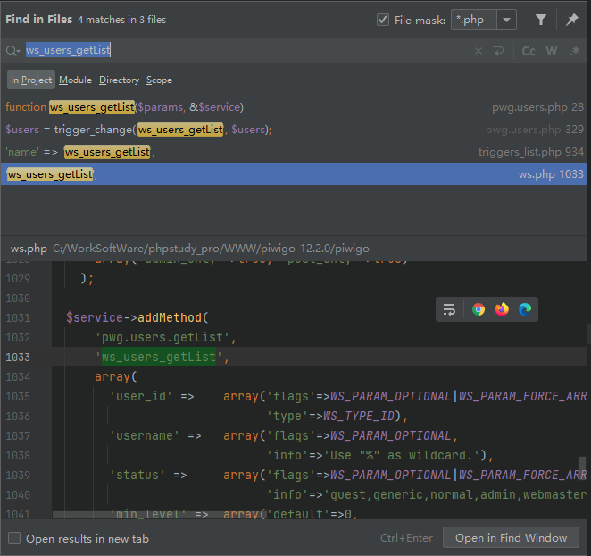
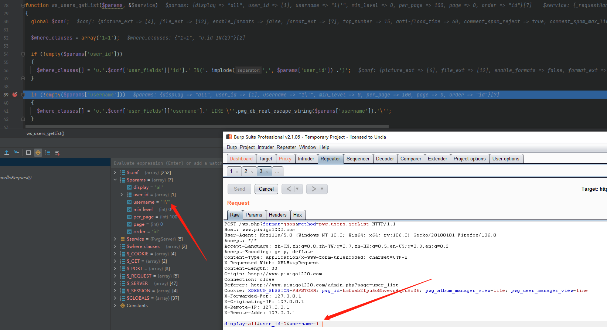
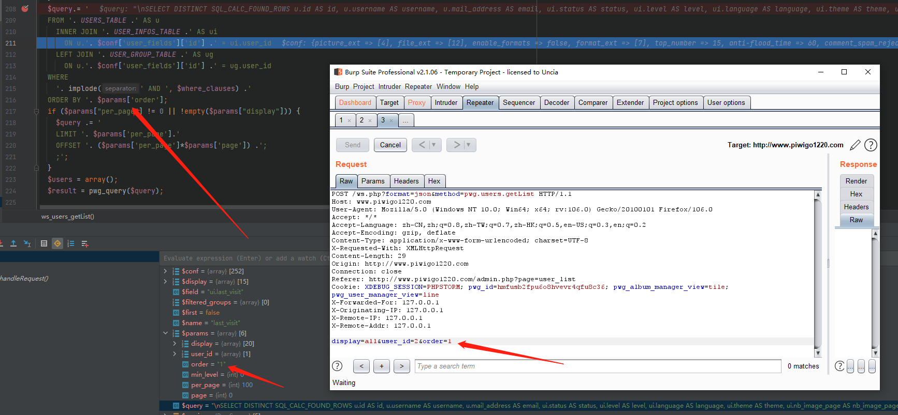
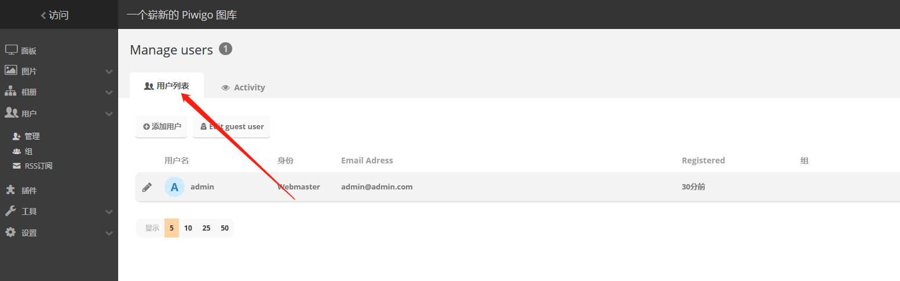
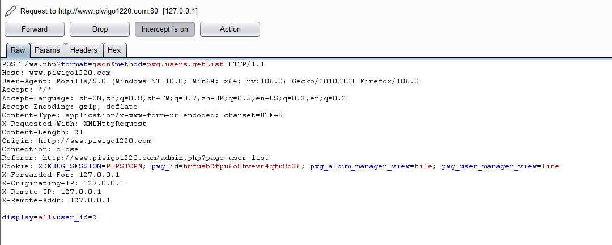

# Piwigo_12.2.0_SQL注入_CVE-2022-26266

本文仅用于技术讨论与研究，文中的实现方法切勿应用在任何违法场景。如因涉嫌违法造成的一切不良影响，本文作者概不负责。

## 0x00 漏洞描述

`Piwigo` 在 12.2.0 版本的 `pwg.users.php` 文件中发现一枚`SQL` 注入漏洞，可通过该漏洞获取数据库中的数据。

## 0x01 漏洞环境

`Piwigo` 可以通过 `github` 或者其官网下载。

`github` 地址：https://github.com/Piwigo/Piwigo

官网：https://piwigo.org/

## 0x02 漏洞分析

`cve` 官方漏洞描述中已经点出漏洞文件为 `pwg.users.php` ，我们直接看到这里，位于 `include/ws_functions/pwg.users.php`

这里很多数据库操作，而且很多都是在拼接，出现注入的概率确实挺大的。

这个文件全都是函数，也就是说我们无法直接访问到这里，因此现在需要做的是找到调用的位置

第一个函数是 `ws_users_getList` ，直接全局搜索该函数



在这里的 `ws.php` 中，`ws_users_getList` 被 `addMethod` 添加到 `$service` 的 `method` 列表中，实际上这里是 `piwigo` 自身定义的访问模式，这里就不细讲了，大概就是将一些路由与函数绑定在一起，当出现访问时，通过回调的方式去访问。

要想访问 `ws_users_getList` ，我们只需要访问 `ws.php` ，并 `get` 一个 `method` 参数，值为 `pwg.users.getList` 即可。

我们再回来看这个 `ws_users_getList` 的内容



`$params` 中存放的是我们请求的值与系统默认的一些值，看到上图，当我们的输入中带有单引号等特殊字符时，会自动转义，这是系统对输入值的过滤，不允许直接输入单双引号等危险字符。如上很多的拼接字符串都使用不了，因为他们都需要闭合前面的引号，我们只能找可以直接拼接而不用闭合引号的参数。

`order by` 是常用的突破点，我们直接找到此处 208 行，并在输入中输入 `order` 参数



这里我们不用闭合单引号，因此可以直接对其进行注入

## 0x03 漏洞复现

本漏洞需要登录后台利用，登录后如下点击

```
用户 -> 管理 -> 用户列表
```



抓包，但是放掉第一个包，进入第二个包如下



这里并没有 `order` 参数，我们添加进去即可，之后发包可见报错


仅验证，点到即止

## 0x04 总结

这个漏洞比较简单，也是一个比较好发现注入漏洞的地方，相对来说 `order by` 被关注的几率相对较小。

