# Piwigo_12.2.0_SQL注入_CVE-2022-32297

本文仅用于技术讨论与研究，文中的实现方法切勿应用在任何违法场景。如因涉嫌违法造成的一切不良影响，本文作者概不负责。

## 0x00 漏洞描述

`Piwigo` 在 12.2.0 版本的搜索功能中存在一个二次`SQL` 注入漏洞，该漏洞可以从前台获取数据库中的数据。

## 0x01 漏洞环境

`Piwigo` 可以通过 `github` 或者其官网下载。

`github` 地址：https://github.com/Piwigo/Piwigo

官网：https://piwigo.org/

## 0x02 漏洞分析

### 数据插入部分分析

我们先来到前台搜索处，随意搜索，然后抓包查看，这里游客身份进入即可

通过抓包，我们可以抓到处理搜索功能的文件为 `qsearch.php` ，进入后直接下断点

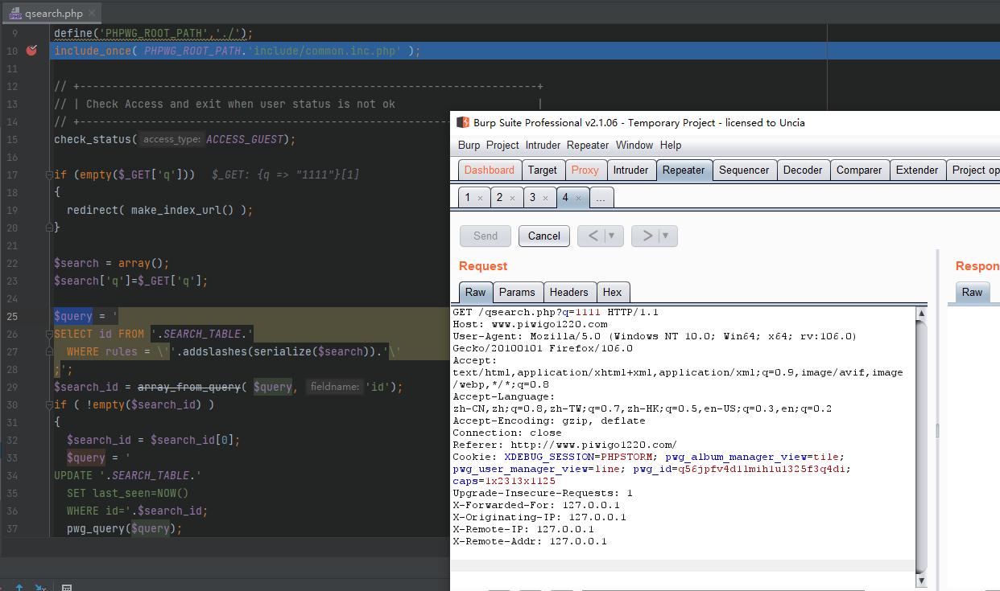

顺利进入该文件，跟进代码，看之后经历的操作，根据网上的信息，该漏洞为二次注入漏洞，因此可以格外关注 `insert into` 的数据库操作。

从上面的图中可以看到搜索的参数为 `q` ，而在代码中也有体现

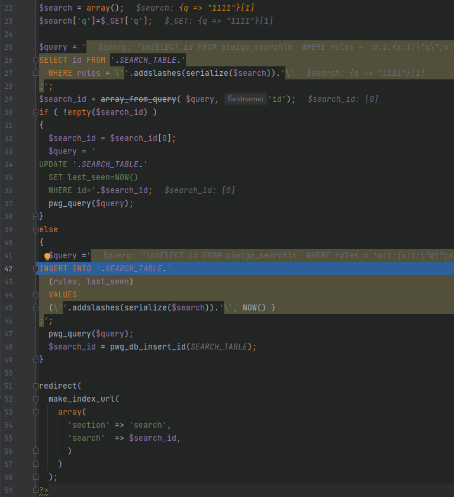

这里实际上就是根据搜索的 `q` 得到 `search` 数组，序列化数组并用 `addslashes` 处理后查找，存在该搜索就更新，不存在就插入，成功插入后返回搜索的 `id` ，这里序列化操作后 `addslashes` 处理了，因此不存在直接的注入漏洞。

这里先简单说一下，其余的部分在后面写出来

### 管理员操作部分

插入值后，寻找该值被使用的位置，直接可以搜索 `SEARCH_TABLE` 

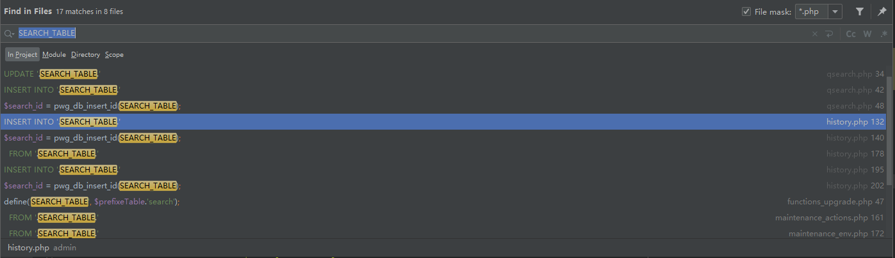

调用的位置不多，可以一个个看，主要关注取值的位置，来到 `admin/history.php` ，根据取值的位置找到如下代码

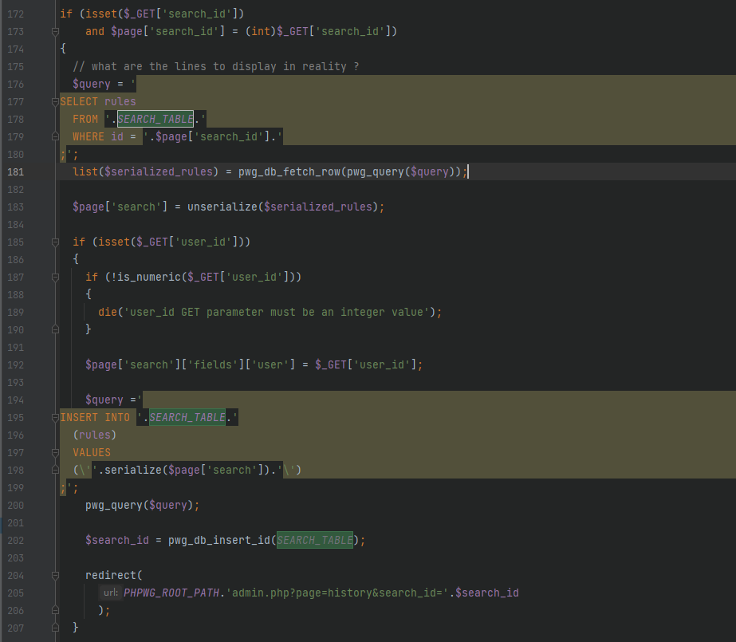

当存在`get` 的参数中存在 `search_id` 时，就会根据 `search_id` 查找 `rules` ，从上一部分的分析来看，这个 `rules` 是被序列化后的查询数据，我们也可以通过直接去看数据库内容看出来

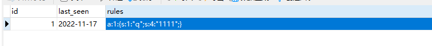

取出来的值直接反序列化，得到 `$page['search']` ，当 `get` 的参数中还存在 `user_id` 时，则会将 `$page['search']` 序列化后再次插入数据库中，但是这里的序列化数据并没有进行处理，也就是说数据里面存在单引号等就可以直接闭合，刚好这里的数据是我们可以利用第一部分的搜索操作控制的，因此造成了一个二次注入。

这里的构造需要很巧妙，既要闭合 `SQL` 操作，又要通过序列化操作，不得不说这个漏洞发现者很强，在此之前我是想不到还可以这样玩的。

这里简单说一下构造，因为 `insert` 是支持一次性插入多条数据的，通过逗号隔开即可，我们第一步的搜索语句中，插入时存在 `addslashes` ，因此插进去时是什么样子，拿出来也会是什么样子，这里一部分先闭合，随意给一个值即可，比如给一个 `test'` ，此处 `insert` 只有一个字段，因此必须先闭合括号，然后开启插入的第二个数据，写一下大概就是如下

```
test'),
```

由于这个字段的数据都是序列化后的，因此我们必须满足序列化的规则才方便被正常取出，我们先构造一个获取管理员密码的语句如下：

```
SELECT password FROM piwigo_users where id=1
```

使用这条语句获取到密码后，再将其放入模板中

```
a:1:{s:1:"q";s:4:"xxxx";}
```

`xxxx` 就是我们获取到的密文，前面的4跟随密文长度变化，我看了下，这里加密方式产出的密文好像都是 34 位，因此这里直接设 34。

密码获取需要通过上面的语句获取，使用 `concat` 拼接获取，配合前面的内容得到

```
test'),((select concat('a:1:{s:1:"q";s:34:"',(SELECT password FROM piwigo_users where id=1),'";}')))#
```

构造如上 `payload` ，通过前台搜索功能插入后，在这里就可以获取到密文，并将密文存储到数据库中

### 访问前台获取密码

接下来是获取该数据库内容，因此涉及的数据库仍然是刚刚的数据库，可以继续搜索 `SEARCH_TABLE` ，找到一处前台获取该数据库内容的位置，位于 `include/functions_search.inc.php`

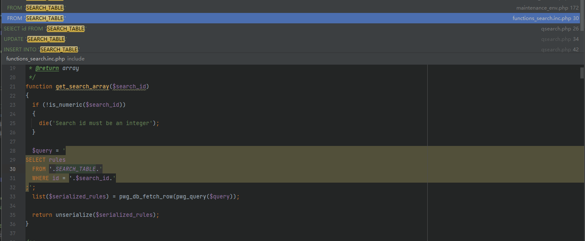

这里是一个函数，直接根据 `$search_id` 搜索，然后反序列化 `rules` 后返回，我们看看调用位置

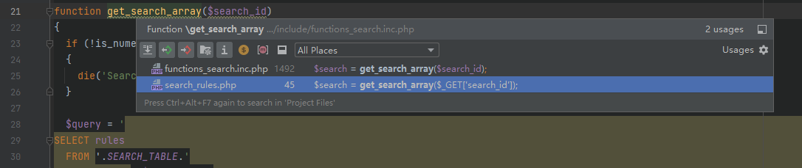

定位到 `search_rules.php` 

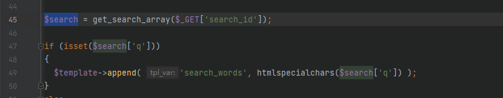

比较简单就知道可以成功获取。

## 0x03 漏洞复现

### 将payload通过前台插入数据库

按照之前说的注入

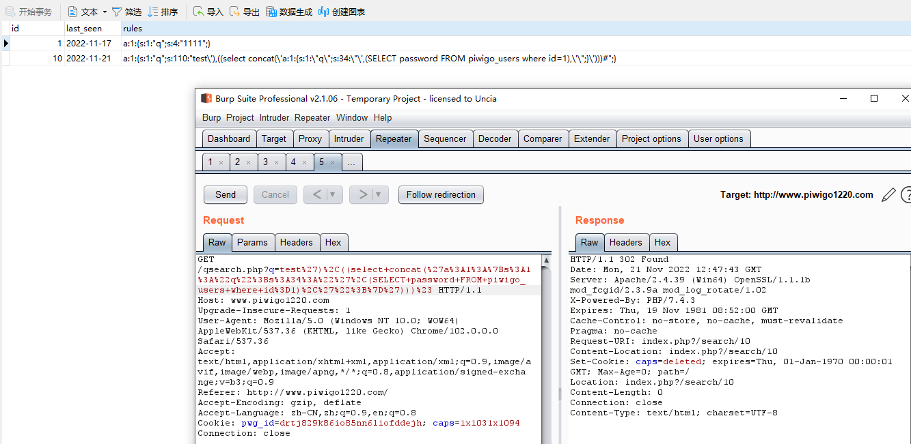

记录返回的 `id` 值，对应插入记录的 `id`

但是发现之后的利用会出错，这是为什么呢？按照前面说的，这里的 `q` 写入的是什么，之后获取就应该是那个值，但是 `$_GET` 在利用前实际上会被处理一次，位于 `include/common.inc.php` ，这是文件开头就会调用的

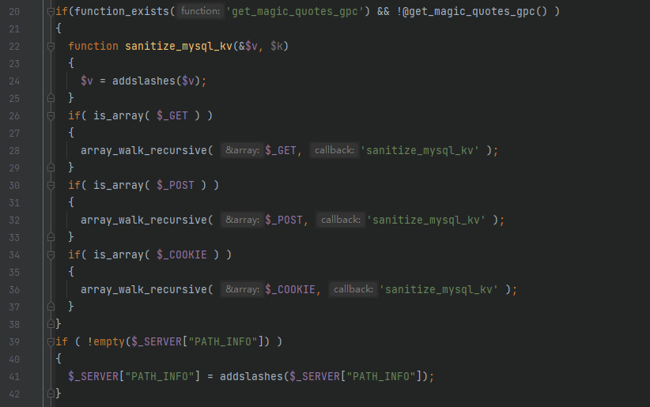

因此我们这里写入的 `payload` 中的单引号会被加上 `\` ，就像上面图中的数据库 一样

这里的解决方法是将参数 `q` 作为一个数组写入，数组的键为 `payload` ，而 之后的处理由于是序列化，因此这个键也会被写入，之后取出来也适用。

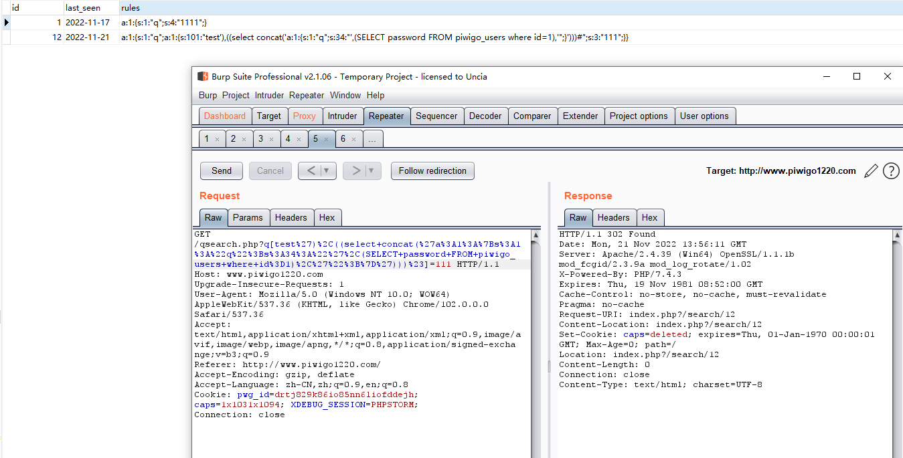

如此，进入数据库的值就不会被转义了

### 管理员用户点击该漏洞链接

此操作需要管理员权限

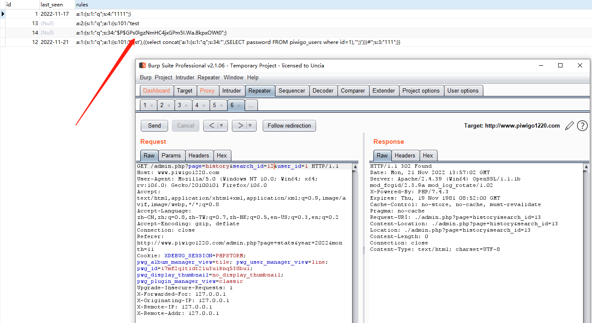

可以看到，执行完后，会在数据库中生成两条记录，其中一条就获取到了密文

### 攻击者前台访问获取密码

这里唯一需要注意的一点是我们需要知道 `search_id` ，也就是插入的那条含有密文的数据的 `id` 值

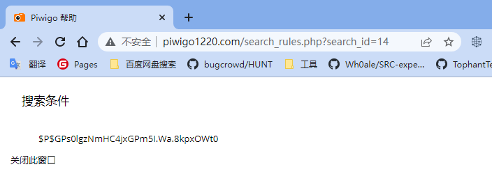

## 0x04 总结

本漏洞比较难以发现，虽然需要管理员用户点击，但用户可以从前台获取到数据，相对来说会比 `CVE-2022-26266` 的危害更加大。这个漏洞让我想起了 `Laravel` `Debug` 漏洞，同样是取出来后又放进去，从而导致了漏洞，虽然造成漏洞的本质并不一样，但有着异曲同工之妙。
